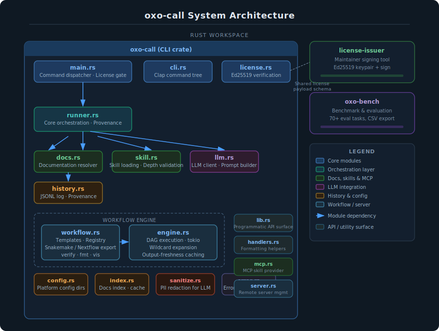
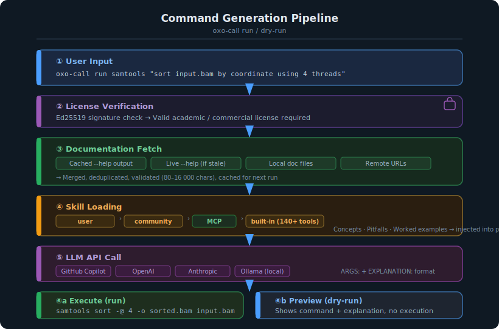

# System Architecture



## Overview

oxo-call is a Rust workspace with three crates:

| Crate | Purpose | Published |
|-------|---------|-----------|
| `oxo-call` (root) | End-user CLI | Yes (crates.io) |
| `crates/license-issuer` | Maintainer-only license signing tool | No |
| `crates/oxo-bench` | Benchmarking and evaluation suite | No |

## Module Structure

The main CLI crate contains the following modules with clear separation of concerns:

```text
main.rs             — Command dispatcher & license gate
  ├─→ cli.rs        — Command definitions (Clap)
  ├─→ handlers.rs   — Extracted command-handler helpers (formatting, suggestions)
  ├─→ license.rs    — Ed25519 offline verification
  ├─→ runner.rs     — Core orchestration pipeline + provenance tracking
  │     ├─→ docs.rs        — Documentation resolver
  │     ├─→ skill.rs       — Skill loading system + depth validation
  │     │     └─→ mcp.rs   — MCP skill provider (JSON-RPC / HTTP)
  │     ├─→ llm.rs         — LLM client, prompt builder & provider trait
  │     └─→ history.rs     — Command history tracker with provenance
  ├─→ sanitize.rs   — Data anonymization for LLM contexts
  ├─→ server.rs     — Remote server management (SSH / HPC)
  ├─→ workflow.rs   — Templates & registry
  │     └─→ engine.rs      — DAG execution engine
  ├─→ config.rs     — Configuration management
  ├─→ index.rs      — Documentation index
  └─→ error.rs      — Error type definitions
lib.rs              — Programmatic API surface (re-exports all modules)
```

## Execution Flow



### Command Generation (run/dry-run)

```text
1. License verification (Ed25519 signature check)
2. Documentation fetch (cache → --help → local files → remote URLs)
3. Skill loading (user → community → MCP → built-in)
4. Prompt construction (docs + skill + task → system + user message)
5. LLM API call (GitHub Copilot / OpenAI / Anthropic / Ollama)
6. Response parsing (extract ARGS: and EXPLANATION: lines)
7. Command execution (run) or display (dry-run)
8. History recording (JSONL with UUID, exit code, timestamp)
```

### Workflow Execution

```text
1. Parse .oxo.toml workflow definition
2. Expand wildcards ({sample}, {params.*})
3. Build dependency DAG
4. Topological sort for execution order
5. Execute with tokio parallelism (JoinSet)
6. Skip steps with fresh outputs (output-freshness caching)
```

## Design Principles

1. **License-first**: Core commands require valid Ed25519 signature
2. **Docs-first grounding**: Documentation fetched before LLM call to prevent hallucination
3. **Offline-first**: Cached docs, no license server, optional remote fetching
4. **Skill-augmented prompting**: Domain knowledge injected without code changes
5. **Platform independence**: WASM conditional compilation, cross-platform config dirs
6. **Strict LLM contract**: ARGS:/EXPLANATION: format with retry on invalid response
