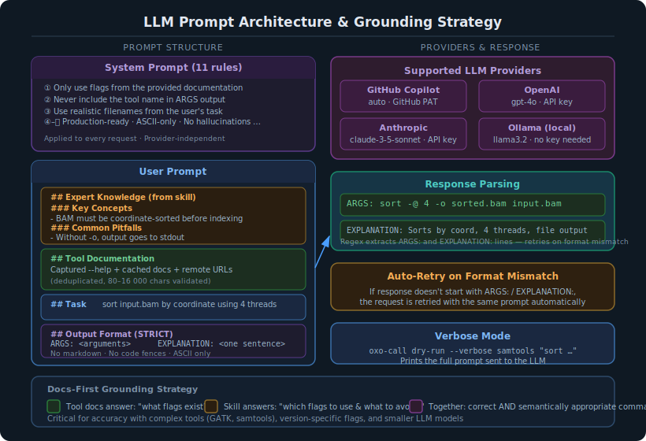

# LLM Integration



## Overview

oxo-call supports four LLM providers for command generation:

| Provider | Default Model | Token Required |
|----------|--------------|----------------|
| GitHub Copilot | gpt-4.1-mini (⭐ free tier) | Yes (GitHub App token via `oxo-call config login`) |
| OpenAI | gpt-4o | Yes |
| Anthropic | claude-3-5-sonnet-20241022 | Yes |
| Ollama | llama3.2 | No (local) |

## LLM Roles

oxo-call uses the LLM in up to three distinct roles per invocation:

| Role | Trigger | System Prompt |
|------|---------|---------------|
| **Command generation** (always) | Every `run` / `dry-run` | Expert bioinformatics command generator |
| **Task optimization** (`--optimize-task`) | Pre-generation step | Expand and clarify the user's task description |
| **Result verification** (`--verify`) | Post-execution step | Expert bioinformatics QC analyst |

Each role uses a separate system prompt so the LLM behaves appropriately for the job.

## Command Generation Prompt

### System Prompt

The command generation system prompt contains 11 rules that constrain the LLM's behavior:

1. Only use flags documented in the provided documentation
2. Never include the tool name in the ARGS output
3. Use realistic filenames from the user's task description
4. Generate production-ready commands
5. Follow bioinformatics conventions
6. Never hallucinate flags or options
7. Support multi-step operations
8. Use threading when available
9. Match the output format to the task
10. Handle strand-specific protocols correctly
11. Output ASCII-only characters

### Response Format

The LLM must respond with exactly two labeled lines:

```
ARGS: <generated arguments>
EXPLANATION: <brief explanation of why these arguments were chosen>
```

If the response doesn't match this format, oxo-call retries the request.

### Raw Prompt Example

Below is an example of the complete user prompt sent to the LLM for a `samtools sort` task. This shows the actual structure including skill injection and format instructions.

```
# Tool: `samtools`

## Expert Knowledge (from skill)

### Key Concepts
- BAM files MUST be coordinate-sorted before indexing with samtools index
- Use -@ to set additional threads for parallel processing
- samtools view -F 0x904 filters out unmapped, secondary, and supplementary reads

### Common Pitfalls
- Forgetting to index after sorting — samtools index requires a coordinate-sorted BAM
- Using -q without -b — quality filtering without BAM output produces SAM to stdout
- Not specifying -o — output goes to stdout by default, which can corrupt terminal

### Worked Examples
Task: sort a BAM file by coordinate
Args: sort -o sorted.bam input.bam
Explanation: coordinate sort is the default; -o specifies output file

Task: index a sorted BAM file
Args: index sorted.bam
Explanation: creates .bai index required for random access

## Tool Documentation
<captured --help output and cached documentation>

## Task
sort input.bam by coordinate and output to sorted.bam

## Output Format (STRICT — do not add any other text)
Respond with EXACTLY two lines:

ARGS: <all command-line arguments, space-separated, WITHOUT the tool name itself>
EXPLANATION: <one concise sentence explaining what the command does>

RULES:
- ARGS must NOT start with the tool name
- ARGS must only contain valid CLI flags and values (ASCII, tool syntax)
- EXPLANATION should be written in the same language as the Task above
- Include every file path mentioned in the task
- Use only flags documented above or shown in the skill examples
- Prefer flags from the skill examples when they match the task
- If no arguments are needed, write: ARGS: (none)
- Do NOT add markdown, code fences, or extra explanation
```

Use `--verbose` mode to see the actual prompt for any command:

```bash
oxo-call dry-run --verbose samtools "sort input.bam by coordinate"
```

## Task Optimization (`--optimize-task`)

When `--optimize-task` is set, an extra LLM call is made **before** command generation. The LLM is asked to rewrite the user's task into a precise bioinformatics instruction:

- Clarifies ambiguous terms (e.g., "sort bam" → "sort BAM file input.bam by coordinate …")
- Infers bioinformatics defaults (paired-end, hg38, 8 threads, gzipped output, etc.)
- Preserves all file names and paths from the original task
- Responds in the same language as the original task

The optimized task is shown to the user when it differs from the original and replaces the original in the command generation prompt.

## Result Verification (`--verify`)

When `--verify` is set on `run` or `workflow run`, an extra LLM call is made **after** execution. The LLM acts as a bioinformatics QC analyst and analyses:

- The exit code of the completed command
- Any stderr output (error keywords, tool-specific patterns, alignment rates, etc.)
- Declared output files — their existence and sizes

The structured response includes:

- `STATUS: success | warning | failure`
- `SUMMARY:` a one-sentence verdict in the same language as the task
- `ISSUES:` a list of detected problems (empty when clean)
- `SUGGESTIONS:` actionable fixes

Verification is advisory — it never changes the process exit code. In JSON mode (`--json`), a `verification` block is appended to the output.

## Provider Configuration

See the [Configuration tutorial](../tutorials/configuration.md) for setup instructions.

## Grounding Strategy

oxo-call uses a "docs-first" grounding strategy:

1. Tool documentation is fetched and included in the prompt
2. If a skill exists, expert knowledge is injected
3. The combined context prevents the LLM from hallucinating flags

This approach is critical for accuracy, especially with:

- Complex tools with hundreds of options
- Tools with version-specific flag differences
- Smaller or weaker LLM models
