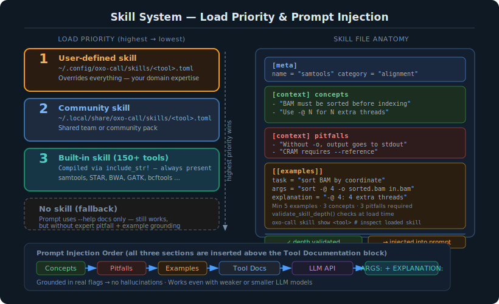

# Skill System



## Overview

The skill system is oxo-call's knowledge engineering layer. Skills are Markdown files with YAML front-matter that inject domain-expert knowledge about specific bioinformatics tools into the LLM prompt.

## How Skills Improve Accuracy

Without skills, the LLM relies solely on:
- Its training data (which may be outdated)
- The tool's `--help` output (which may be terse)

With skills, the LLM also receives:
- **Key concepts** — fundamental domain knowledge the LLM needs
- **Common pitfalls** — mistakes to avoid (with explanations)
- **Worked examples** — task → args mappings that demonstrate correct usage

## Skill File Format

Skills use the `.md` format: a YAML front-matter block followed by Markdown sections.

```markdown
---
name: samtools
category: alignment
description: Suite of programs for SAM/BAM/CRAM handling
tags: [bam, sam, cram, alignment, ngs]
author: oxo-call built-in
source_url: http://www.htslib.org/doc/samtools.html
---

## Concepts

- BAM is binary (fast), CRAM is reference-compressed (smallest)
- BAM MUST be coordinate-sorted BEFORE indexing
- Use -@ N for N threads

## Pitfalls

- Without -o, samtools writes to stdout — always use -o
- CRAM requires --reference or it fails silently

## Examples

### Sort a BAM file by genomic coordinates
**Args:** `sort -@ 4 -o sorted.bam input.bam`
**Explanation:** -@ 4 uses 4 threads; -o outputs BAM in sorted order
```

### Format rules

| Element | Format |
|---------|--------|
| Front-matter | YAML between `---` delimiters |
| Concepts | `## Concepts` heading, then `- ` bullet items |
| Pitfalls | `## Pitfalls` heading, then `- ` bullet items |
| Examples | `## Examples` heading; each example starts with `### Task description` |
| Args | `**Args:** \`command --flag value\`` (backtick-wrapped) |
| Explanation | `**Explanation:** text` |

> **Legacy support**: `.toml` skill files created with older oxo-call versions still load correctly.

## Load Priority

Skills are loaded with the following precedence (highest wins):

1. **User-defined**: `~/.config/oxo-call/skills/<tool>.md`
2. **Community-installed**: `~/.local/share/oxo-call/skills/<tool>.md`
3. **Built-in**: Compiled into the binary via `include_str!`

Both `.md` and `.toml` extensions are checked for user and community skills.

## Built-in Coverage (150+ Tools)

| Domain | Tools |
|--------|-------|
| QC & preprocessing | samtools, fastp, fastqc, multiqc, trimmomatic, cutadapt, trim_galore, picard |
| Short-read alignment | bwa, bwa-mem2, bowtie2, hisat2, star, chromap |
| Long-read alignment | minimap2, pbmm2 |
| RNA-seq | salmon, kallisto, rsem, stringtie, featurecounts, trinity, arriba |
| Variant calling | gatk, bcftools, freebayes, deepvariant, strelka2, varscan2, longshot |
| Structural variants | manta, delly, sniffles, pbsv, survivor, truvari |
| Epigenomics | macs2, deeptools, bismark, methyldackel, homer, modkit |
| Metagenomics | kraken2, bracken, metaphlan, diamond, prokka, bakta, metabat2, checkm2, gtdbtk |
| Single-cell | cellranger, starsolo, kb, velocyto, cellsnp-lite |
| Long-read (ONT/PacBio) | dorado, nanoplot, nanostat, chopper, porechop, racon, medaka |
| De novo assembly | spades, megahit, flye, hifiasm, canu, miniasm, wtdbg2, verkko |
| Phylogenetics | mafft, muscle, iqtree2, fasttree |
| Population genomics | plink2, admixture, angsd |

## Creating Custom Skills

```bash
# Generate a template
oxo-call skill create mytool -o ~/.config/oxo-call/skills/mytool.md

# Edit the file with your domain knowledge
vim ~/.config/oxo-call/skills/mytool.md

# Verify it loads correctly
oxo-call skill show mytool
```

