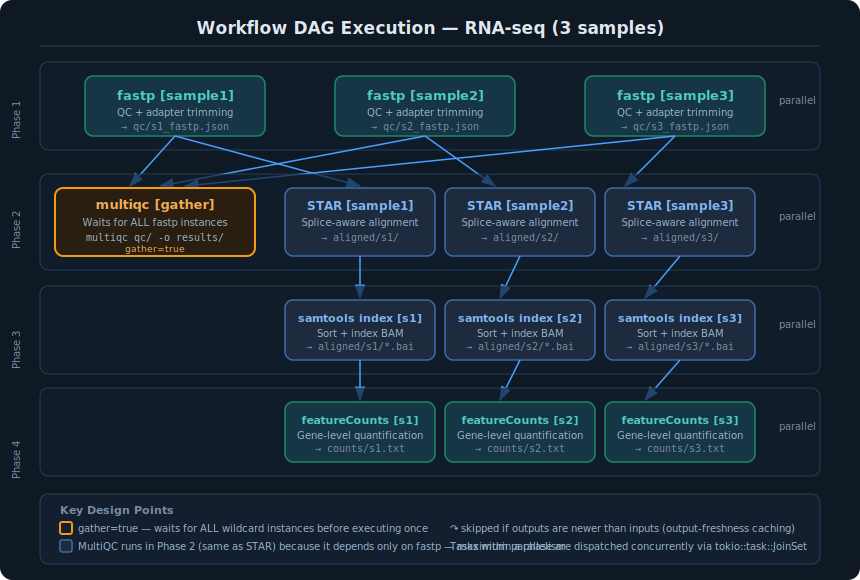

# Workflow Engine

## Overview

oxo-call includes a native Rust workflow engine that executes `.oxo.toml` pipeline files. Unlike traditional workflow managers, it requires no external dependencies — no Snakemake, Nextflow, or Conda. Only the bioinformatics tools themselves need to be installed.

## Architecture



### DAG Execution

The engine builds a Directed Acyclic Graph (DAG) from step dependencies:

1. **Parse** — Load workflow definition from `.oxo.toml` (TOML format)
2. **Expand** — Expand wildcards (`{sample}`) across all step definitions
3. **Resolve** — Build explicit dependency edges between concrete tasks
4. **Phase** — Group tasks into execution phases (sets of independent tasks)
5. **Execute** — Run tasks with maximum parallelism via `tokio::task::JoinSet`
6. **Cache** — Track output freshness to skip completed steps automatically

### Wildcard System

- **`{sample}`** — Expands to each value in the `[wildcards]` section
- **`{params.key}`** — Substitutes values from the `[params]` section
- **Gather steps** — Steps with `gather = true` run once after ALL wildcard instances of their dependency steps complete

### Execution Phases

The engine automatically computes execution phases — groups of tasks that can run in parallel. Tasks within a phase have no mutual dependencies and execute concurrently.

Example for the RNA-seq template with 3 samples:

```
Phase 1: fastp[s1]  fastp[s2]  fastp[s3]          (3 tasks in parallel)
    ↓
Phase 2: multiqc [gather]  │  star[s1]  star[s2]  star[s3]  (QC + alignment in parallel)
    ↓
Phase 3: samtools_index[s1]  samtools_index[s2]  samtools_index[s3]
    ↓
Phase 4: featurecounts[s1]  featurecounts[s2]  featurecounts[s3]
```

This demonstrates a key design principle: **MultiQC runs in the same phase as STAR** because both depend only on fastp. The engine exploits this independence automatically — no manual phase assignment is needed.

### Complex DAG Patterns

The engine supports arbitrary DAG topologies, not just linear chains:

- **Diamond dependencies**: Step D depends on both B and C, which both depend on A
- **Fan-out / fan-in**: A single step fans out to many parallel tasks, then gathers
- **Multiple gather points**: Several gather steps can exist at different points in the DAG
- **Cross-branch dependencies**: A step can depend on steps from different branches

Example — ChIP-seq with parallel peak calling and coverage branches:

```
Phase 1: fastp[s1]  fastp[s2]  fastp[s3]
    ↓
Phase 2: multiqc [gather]  │  bowtie2[s1]  bowtie2[s2]  bowtie2[s3]
    ↓
Phase 3: mark_duplicates[s1]  mark_duplicates[s2]  mark_duplicates[s3]
    ↓
Phase 4: filter[s1]  filter[s2]  filter[s3]
    ↓
Phase 5: macs3[s1]  macs3[s2]  macs3[s3]  │  bigwig[s1]  bigwig[s2]  bigwig[s3]
```

Here `macs3` and `bigwig` both depend on `filter` and execute in parallel.

### Progress Display

During execution, the engine displays:

- **DAG phase diagram** — shows the pipeline structure with parallel groups
- **Step counter** — `[N/M]` progress indicator for each completed task
- **Status symbols** — `▶` running, `✓` success, `↷` skipped (up to date)
- **Elapsed time** — total wall-clock time at completion

### Output Freshness Caching

The engine automatically skips tasks whose outputs are already up to date:

- A task is **skipped** if all its outputs exist AND are newer than all its inputs
- A task **always runs** if any output is missing or any input is newer than the oldest output
- Tasks without declared outputs always run

**Reliability notes:**

- Freshness is determined by file modification time (`mtime`), not content hashing. This is fast but can miss changes if a file is overwritten with identical content.
- If a step fails mid-execution, its partial outputs may remain on disk. Re-running the workflow will skip the failed step if all declared output files exist and their modification times are newer than the inputs. To force re-execution, delete the output files or the output directory for that step.
- Missing input files do not block freshness checks — if an input file does not exist on disk, it is treated as having no timestamp, so the freshness comparison passes. This is by design for steps that reference optional or generated inputs, but it means you should declare all real input files in the `inputs` field to get correct skip-if-fresh behavior.

### MultiQC Aggregation Pattern

All built-in templates follow a consistent pattern where **MultiQC is an upstream QC aggregation step**:

1. MultiQC is configured as a `gather = true` step
2. It depends on the **QC/preprocessing step** (e.g., fastp, trim_galore, or nanostat)
3. It runs **in parallel** with downstream analysis steps (alignment, variant calling, etc.)
4. The MultiQC command scans the QC output directory with `--force` for consistent reruns

This design ensures QC reports are available early — researchers can inspect quality metrics while alignment and quantification proceed in parallel.

## File Format (.oxo.toml)

```toml
[workflow]
name        = "my-pipeline"
description = "Pipeline description"
version     = "1.0"

[wildcards]
sample = ["sample1", "sample2", "sample3"]

[params]
threads    = "8"
reference  = "/path/to/genome.fa"
gtf        = "/path/to/annotation.gtf"

[[step]]
name    = "qc"
cmd     = "fastp --in1 data/{sample}_R1.fq.gz --in2 data/{sample}_R2.fq.gz --out1 trimmed/{sample}_R1.fq.gz --out2 trimmed/{sample}_R2.fq.gz --json qc/{sample}_fastp.json"
inputs  = ["data/{sample}_R1.fq.gz", "data/{sample}_R2.fq.gz"]
outputs = ["trimmed/{sample}_R1.fq.gz", "trimmed/{sample}_R2.fq.gz", "qc/{sample}_fastp.json"]

# MultiQC runs right after QC, in parallel with alignment
[[step]]
name       = "multiqc"
gather     = true
depends_on = ["qc"]
cmd        = "multiqc qc/ -o results/multiqc/ --force"
outputs    = ["results/multiqc/multiqc_report.html"]

[[step]]
name       = "align"
depends_on = ["qc"]
cmd        = "STAR --genomeDir {params.reference} --readFilesIn trimmed/{sample}_R1.fq.gz trimmed/{sample}_R2.fq.gz --outFileNamePrefix aligned/{sample}/"
inputs     = ["trimmed/{sample}_R1.fq.gz", "trimmed/{sample}_R2.fq.gz"]
outputs    = ["aligned/{sample}/Aligned.sortedByCoord.out.bam"]
```

### Step Fields Reference

| Field | Type | Required | Description |
|-------|------|----------|-------------|
| `name` | string | yes | Unique step identifier, used in `depends_on` |
| `cmd` | string | yes | Shell command with `{wildcard}` and `{params.key}` substitution |
| `depends_on` | list | no | Names of steps that must complete first |
| `inputs` | list | no | Input file patterns for freshness checking |
| `outputs` | list | no | Output file patterns for freshness checking and skip-if-fresh |
| `gather` | bool | no | When `true`, runs once after ALL wildcard instances of deps |
| `env` | string | no | Shell preamble (e.g., conda activate, PATH override) |

## Environment and Interpreter Management

### The `env` Field

Bioinformatics pipelines often require different runtime environments for different steps — for example, one tool may require Python 2 while another requires Python 3, or different tools may need different conda environments.

The optional `env` field on each step provides a shell preamble that executes before the main command:

```toml
[[step]]
name = "legacy_tool"
env  = "conda activate py27_env &&"
cmd  = "python2 legacy_script.py {sample}"

[[step]]
name       = "modern_tool"
depends_on = ["legacy_tool"]
env        = "conda activate py3_env &&"
cmd        = "python3 modern_analysis.py {sample}"
```

### Common Patterns

**Conda environment activation:**

```toml
env = "conda activate myenv &&"
```

**Virtual environment activation:**

```toml
env = "source /opt/venvs/tool_venv/bin/activate &&"
```

**PATH override for a specific tool version:**

```toml
env = "export PATH=/opt/star-2.7.11b/bin:$PATH &&"
```

**Module system (HPC clusters):**

```toml
env = "module load samtools/1.21 &&"
```

### Design Notes

- The `env` preamble is prepended to the `cmd` as a single shell string passed to `sh -c`. This means it shares the same shell session as the command.
- Environment changes do **not** leak between steps — each step starts with a clean shell.
- If a step does not need a special environment, omit the `env` field entirely.
- When exporting to Snakemake or Nextflow, consider using their native environment management (conda directives, container images) instead of the `env` field.
- **Security note**: The `env` field is passed directly to the shell. Only use values from trusted `.oxo.toml` files that you have reviewed. Do not use `env` values from untrusted or user-supplied workflow files without inspection.

## Reliability Considerations

### Step Ordering

Steps in the `.oxo.toml` file must be declared in dependency order — a step can only reference dependencies that appear **before** it in the file. The `workflow verify` command will warn about forward references.

### Error Handling

- If any task fails (non-zero exit code), the entire workflow is aborted immediately.
- Tasks that are already running in parallel will complete, but no new tasks will be dispatched.
- The failed task's step name, exit code, and command are printed for diagnosis.

### Cycle Detection

The engine detects dependency cycles at two levels:

1. **At expansion time**: Forward-reachability check on the concrete task graph
2. **At verification time**: `workflow verify` warns about forward references and unknown step names

### Concurrent Execution Safety

- Each task runs in its own `sh -c` subprocess — no shared state between tasks.
- Output directories are created automatically before command execution.
- The `tokio::task::JoinSet` manages concurrent task scheduling with proper backpressure.

## Compatibility Export

### Snakemake

```bash
oxo-call workflow export rnaseq --to snakemake -o Snakefile
```

The generated Snakefile includes:

- `rule all` collecting leaf outputs
- Individual rules with `input`, `output`, `log`, and `shell` blocks
- `expand()` for wildcard substitution
- `configfile: "config.yaml"` with parameter template

### Nextflow (DSL2)

```bash
oxo-call workflow export wgs --to nextflow -o main.nf
```

The generated Nextflow file includes:

- `nextflow.enable.dsl = 2`
- Individual `process` blocks with `input`, `output`, and `script` sections
- `workflow` block chaining processes via channels
- Gather steps use `.collect()` for channel aggregation

## Built-in Templates

Use `oxo-call workflow list` to see all available templates. Each template provides:

- **Native** (`.oxo.toml`) — primary format for the built-in engine
- **Snakemake** (`.smk`) — hand-optimized Snakefile with container directives
- **Nextflow** (`.nf`) — DSL2 with process emit labels and channel operators

All templates include container image references for reproducible execution and follow bioinformatics best practices for tool parameter defaults.
